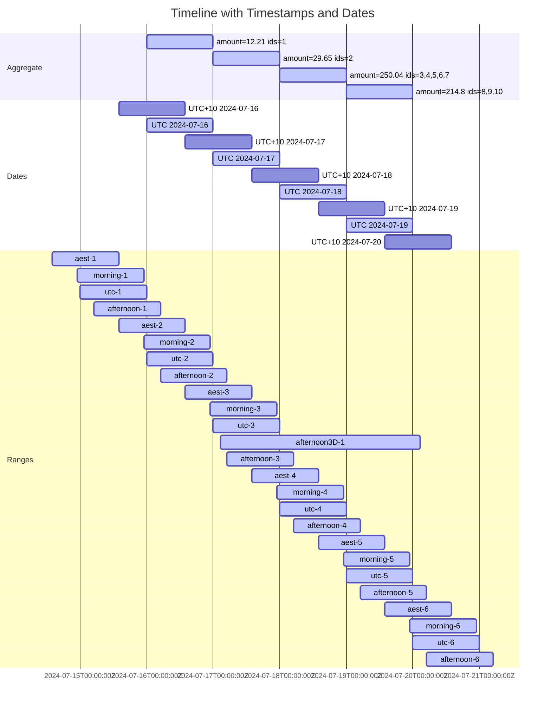

# Dates, Timestamps, and Aggregated Data

## What?

Aggregation summarizes data but can lead to a loss of resolution, complicating reporting. Data may not fit neatly into
reporting periods, especially when aggregated into regular, calendar-aligned intervals (e.g., daily, weekly).

This repository focuses on daily, UTC-aligned aggregation and provides algorithms to convert between timestamp and date
ranges for filtering queries.

## Why?

1. **Misalignment:** Data resolution and reporting periods often don't match, causing issues. For example, reporting on
   a one-week period with UTC-aligned daily data starting at midnight in a different time zone.
2. **Outliers:** Misalignment can skew results, especially with outliers at report boundaries.
3. **Multiple Sources:** Discrepancies are more evident when reports are built from multiple sources with varying
   alignments.
4. **Debugging Challenges:** Discrepancies can obscure unrelated issues, making debugging difficult.

Note: Issues like ranges smaller than the aggregation period are not addressed here.

## Representing Time Ranges

### Preface

This repository focuses on strategies for handling daily aggregated data (midnight to midnight, UTC), stored with
a `date` field in UTC. The conversion algorithm allows selecting data using timestamp ranges, supporting arbitrary
reporting periods across misaligned or non-aggregated data.

### Considerations

1. **Conversion:**
    - Converting timestamps to other representations is straightforward.
    - Converting dates to timestamps requires careful handling of offsets and context.
    - Local dates (e.g., Java's `OffsetDateTime` truncated to date) should be used cautiously to avoid unexpected
      results due to time zone differences.

2. **Contiguous Ranges:**
    - Important for APIs to ensure ranges are seamless without overlap or gaps.
    - Example: `[startTime, endTime)`, followed by `[startTime + 1 day, endTime + 1 day)`, guarantees no duplication or
      gaps.

3. **Time Continuity:**
    - Timestamps should be half-open ranges `[startTime, endTime)` to reliably represent continuous time.
    - Closed ranges can work with nanosecond precision but are generally more challenging.

### Definitions

- **Date Value (matching against a timestamp range):**
    - Daily aggregate, e.g., sum of `amount`, where each data point includes measurements between `"${date}T00:00:00Z"`
      and `"${date + 1 day}T00:00:00Z"`.

- **Timestamp Value (matching against a date range):**
    - Serialized in RFC 3339 format with nanosecond precision, treated as nanosecond-precision epoch.

- **Date Range (matching against a timestamp value):**
    - Closed range `[startDate, endDate]`, inclusive of entire days in UTC. Equivalent timestamp range
      is `["${startDate}T00:00:00Z", "${endDate + 1 day}T00:00:00Z")`.

- **Timestamp Range (matching against a date value):**
    - Half-open range `[startTime, endTime)`, inclusive of `startTime` and exclusive of `endTime`.

## Algorithms

### Trivial Cases

- Both range and value are identical representations (or aligned with UTC).
- All values are aligned (e.g., `T00:00:00+00:00`).

### Conversions

- **Date value, timestamp range:**
    - Select dates where possible timestamps implied by the date value are entirely within the range.

- **Timestamp value, date range:**
    - Convert date range to an equivalent timestamp range, using half-open ranges.

## Implementation

**Note:** See the below [Scenarios](#scenarios) section for a detailed example.

### Overview

tl;dr:
Implement a "narrowing" timestamp-to-date conversion function.
Implement "widen" functions that can be applied prior to conversion, to include
partial days in the range.
Combine both "wide" and "narrow" variants to handle different contexts.

### Golang

See [baseline/baseline.go](./baseline/baseline.go) for examples and functions.

See also the
[API documentation](https://pkg.go.dev/github.com/joeycumines/dates-timestamps-and-aggregated-data),
for easy navigation and reference. You'll need to click into the `baseline`
package.

N.B. This was the initial variant, and is therefore the most well tested.

### PostgreSQL

Example functions for conversion and widening ranges:

```sql
-- returns the first and last (UTC) date fully within the timestamp range, preserving null values
-- WARNING: queries that omit one of the bounds should explicitly omit the filter criteria (unrelated SQL performance note)
create or replace function convert_timestamp_range_to_dates(start_time timestamptz, end_time timestamptz)
    returns table
            (
                start_date date,
                end_date   date
            )
as
$$
begin
    -- Convert start_time to UTC and handle rounding up to the next day if needed
    if start_time is not null then
        start_time := timezone('UTC', start_time);

        -- Round up to the next day if the time is not at the start of the day
        if start_time::date <> start_time then
            start_time := start_time + interval '1 day';
        end if;

        -- Truncate to date
        start_date := start_time::date;
    else
        start_date := null;
    end if;

    -- Convert end_time to UTC and handle rounding down to the previous day if needed
    if end_time is not null then
        end_time := timezone('UTC', end_time);

        -- Adjust end_time to be exclusive, i.e., the previous day if it's at the start of the day
        end_time := end_time - interval '1 day';

        -- Truncate to date
        end_date := end_time::date;
    else
        end_date := null;
    end if;

    return next;
end;
$$ language plpgsql;

create or replace function widen_start_time(t timestamptz) returns timestamptz as
$$
begin
    return date_trunc('day', t);
end;
$$ language plpgsql;

create or replace function widen_end_time(t timestamptz) returns timestamptz as
$$
begin
    if date_trunc('day', t) = t then
        return t;
    else
        return date_trunc('day', t) + interval '1 day';
    end if;
end;
$$ language plpgsql;

create or replace function widen_range(start_time timestamptz, end_time timestamptz)
    returns table
            (
                wide_start_time timestamptz,
                wide_end_time   timestamptz
            )
as
$$
begin
    wide_start_time := widen_start_time(start_time);
    wide_end_time := widen_end_time(end_time);
    return next;
end;
$$ language plpgsql;

-- In comparison, this case is trivial
create or replace function convert_date_range_to_timestamps(start_date date, end_date date)
    returns table
            (
                start_time timestamptz,
                end_time   timestamptz
            )
as
$$
begin
    if start_date is not null then
        start_time := start_date at time zone 'UTC';
    else
        start_time := null;
    end if;
    if end_date is not null then
        end_time := (end_date + interval '1 day') at time zone 'UTC';
    else
        end_time := null;
    end if;
    return next;
end;
$$ language plpgsql;
```

### JavaScript

Demonstrates how a frontend application might use widen to generate an
`endTime` for a range over the last _n_ days, suitable for use within URL query
parameters.
The `startTime` and `endTime` can be reversed, to extract the original
timestamp + number of days. Both bounds are stable, due to being inclusive of
any in-progress day. This mitigates potential confusion, caused by display of
partially aggregated data, while still allowing display of such data in the
interim.

```js
const now = new Date();
const startTime = new Date(now.getTime() - 7 * 24 * 60 * 60 * 1000);
// N.B. logic from widen_end_time, see the other examples
const endTime = new Date(Date.UTC(now.getUTCFullYear(), now.getUTCMonth(), now.getUTCDate()));
if (endTime.getTime() !== now.getTime()) { // if not already start of UTC day
    endTime.setUTCDate(endTime.getUTCDate() + 1);
}

// fetch data, e.g. from a backend API
updateReportContext(startTime.toISOString(), endTime.toISOString());
```

## Scenarios

### Scenario 1

#### Base data

```tsv
id	timestamp	amount
1	2024-07-16 03:41:28.448509Z	12.21
2	2024-07-17 11:18:45.491452Z	29.65
3	2024-07-18 13:58:28.944852Z	70.43
4	2024-07-18 13:59:49.065872Z	71.72
5	2024-07-18 14:00:00.000000Z	0.53
6	2024-07-18 16:50:58.448308Z	68.65
7	2024-07-18 19:59:27.146321Z	38.71
8	2024-07-19 04:41:49.042058Z	92.75
9	2024-07-19 14:09:32.617819Z	24.35
10	2024-07-19 22:55:52.792650Z	97.7
```

#### Aggregate data

```postgresql
select (timestamp at time zone 'UTC')::date as date, sum(amount) as amount, jsonb_agg(id order by id) as ids
from base_data
group by date
order by date;
```

```tsv
date	amount	ids
2024-07-16	12.21	[1]
2024-07-17	29.65	[2]
2024-07-18	250.04	[3, 4, 5, 6, 7]
2024-07-19	214.8	[8, 9, 10]
```

The total amount is `506.7`.

#### Example queries

In practice, it is unlikely that both `base_data` and `aggregate_data` would be
used simultaneously (e.g. displayed on the same page or report). In this case,
the raw data is intended to highlight discrepancies. The `base_data` may be
considered representative of the behavior that other finer-grain (e.g.
timestamp) data (that might be displayed in the same context) could exhibit.

```postgresql
select id, timestamp, amount
from base_data
where timestamp >= :start_time
  and timestamp < :end_time
order by timestamp;
```

```postgresql
select date, amount
from aggregate_data
where date between :start_date and :end_date
order by date;
```

#### Results

N.B. Queries are down the bottom of this section.

##### Total amount by group

The following table is the output of the `amounts_total` query. The `ad_*`
columns are sums from selected `aggregate_data` rows, and the `bd_*` columns
are sums from selected `base_data` rows. The suffix indicates whether each of
the start and end were "wide" (extended to the encapsulating day), or "narrow"
(only inclusive of fully-encapsulated days).

As a baseline, a deliberately naive timestamp -> date implementation was used,
suffixed with `_l` (for local). While this implementation _appears_ reasonably
correct, it will vary, based on the passed timezone, and will only perform
roughly equivalently for callers providing UTC-equivalent timestamp ranges.
For all other cases, the result set may be significantly skewed, as shown by
the difference between `ad_n` and `ad_l`, for the `afternoon3D...` group
(which is a 3d period, starting from `T15:00:00-11:35`).

N.B. Skew is relative to the `actual`, correct result. See the per-day table
for a more detailed breakdown.

| group          | actual | bd_w   | bd_wn  | bd_nw  | ad_n   | ad_w   | ad_wn  | ad_nw  | ad_l  |
|----------------|--------|--------|--------|--------|--------|--------|--------|--------|-------|
| aest           | 506.7  | 1013.4 | 783.46 | 736.64 |        | 1013.4 | 506.7  | 506.7  | 506.7 |
| afternoon      | 506.7  | 1013.4 | 611.66 | 908.44 |        | 1013.4 | 506.7  | 506.7  | 506.7 |
| afternoon3D... | 494.49 | 494.49 | 494.49 | 494.49 | 464.84 | 494.49 | 494.49 | 464.84 | 291.9 |
| morning        | 506.7  | 1013.4 | 1013.4 | 506.7  |        | 1013.4 | 506.7  | 506.7  | 506.7 |
| utc            | 506.7  | 506.7  | 506.7  | 506.7  | 506.7  | 506.7  | 506.7  | 506.7  | 506.7 |

##### Per-day

###### Visualizing days



###### Table

| name           | start_time           | end_time             | wide_start_time      | wide_end_time        | start_date | end_date   | wide_start_date | wide_end_date | local_start_date | local_end_date | actual | bd_w   | bd_wn  | bd_nw  | bd_l   | ad_n   | ad_w   | ad_wn  | ad_nw  | ad_l   | bd_n_ids                     | bd_w_ids                     | bd_wn_ids                    | bd_nw_ids                    | bd_l_ids              | ad_n_ids                  | ad_w_ids                     | ad_wn_ids                    | ad_nw_ids                 | ad_l_ids              |
|----------------|----------------------|----------------------|----------------------|----------------------|------------|------------|-----------------|---------------|------------------|----------------|--------|--------|--------|--------|--------|--------|--------|--------|--------|--------|------------------------------|------------------------------|------------------------------|------------------------------|-----------------------|---------------------------|------------------------------|------------------------------|---------------------------|-----------------------|
| aest-1         | 2024-07-14 14:00...Z | 2024-07-15 14:00...Z | 2024-07-14 00:00...Z | 2024-07-16 00:00...Z | 2024-07-15 | 2024-07-14 | 2024-07-14      | 2024-07-15    | 2024-07-15       | 2024-07-15     |        |        |        |        |        |        |        |        |        |        |                              |                              |                              |                              |                       |                           |                              |                              |                           |                       |
| aest-2         | 2024-07-15 14:00...Z | 2024-07-16 14:00...Z | 2024-07-15 00:00...Z | 2024-07-17 00:00...Z | 2024-07-16 | 2024-07-15 | 2024-07-15      | 2024-07-16    | 2024-07-16       | 2024-07-16     | 12.21  | 12.21  | 12.21  | 12.21  | 12.21  |        | 12.21  |        | 12.21  | 12.21  | [1]                          | [1]                          | [1]                          | [1]                          | [1]                   |                           | [1]                          |                              | [1]                       | [1]                   |
| aest-3         | 2024-07-16 14:00...Z | 2024-07-17 14:00...Z | 2024-07-16 00:00...Z | 2024-07-18 00:00...Z | 2024-07-17 | 2024-07-16 | 2024-07-16      | 2024-07-17    | 2024-07-17       | 2024-07-17     | 29.65  | 41.86  | 41.86  | 29.65  | 29.65  |        | 41.86  | 12.21  | 29.65  | 29.65  | [2]                          | [1, 2]                       | [1, 2]                       | [2]                          | [2]                   |                           | [1, 2]                       | [1]                          | [2]                       | [2]                   |
| aest-4         | 2024-07-17 14:00...Z | 2024-07-18 14:00...Z | 2024-07-17 00:00...Z | 2024-07-19 00:00...Z | 2024-07-18 | 2024-07-17 | 2024-07-17      | 2024-07-18    | 2024-07-18       | 2024-07-18     | 142.15 | 279.69 | 171.8  | 250.04 | 250.04 |        | 279.69 | 29.65  | 250.04 | 250.04 | [3, 4]                       | [2, 3, 4, 5, 6, 7]           | [2, 3, 4]                    | [3, 4, 5, 6, 7]              | [3, 4, 5, 6, 7]       |                           | [2, 3, 4, 5, 6, 7]           | [2]                          | [3, 4, 5, 6, 7]           | [3, 4, 5, 6, 7]       |
| aest-5         | 2024-07-18 14:00...Z | 2024-07-19 14:00...Z | 2024-07-18 00:00...Z | 2024-07-20 00:00...Z | 2024-07-19 | 2024-07-18 | 2024-07-18      | 2024-07-19    | 2024-07-19       | 2024-07-19     | 200.64 | 464.84 | 342.79 | 322.69 | 214.8  |        | 464.84 | 250.04 | 214.8  | 214.8  | [5, 6, 7, 8]                 | [3, 4, 5, 6, 7, 8, 9, 10]    | [3, 4, 5, 6, 7, 8]           | [5, 6, 7, 8, 9, 10]          | [8, 9, 10]            |                           | [3, 4, 5, 6, 7, 8, 9, 10]    | [3, 4, 5, 6, 7]              | [8, 9, 10]                | [8, 9, 10]            |
| aest-6         | 2024-07-19 14:00...Z | 2024-07-20 14:00...Z | 2024-07-19 00:00...Z | 2024-07-21 00:00...Z | 2024-07-20 | 2024-07-19 | 2024-07-19      | 2024-07-20    | 2024-07-20       | 2024-07-20     | 122.05 | 214.8  | 214.8  | 122.05 |        |        | 214.8  | 214.8  |        |        | [9, 10]                      | [8, 9, 10]                   | [8, 9, 10]                   | [9, 10]                      |                       |                           | [8, 9, 10]                   | [8, 9, 10]                   |                           |                       |
| afternoon-1    | 2024-07-15 05:00...Z | 2024-07-16 05:00...Z | 2024-07-15 00:00...Z | 2024-07-17 00:00...Z | 2024-07-16 | 2024-07-15 | 2024-07-15      | 2024-07-16    | 2024-07-15       | 2024-07-15     | 12.21  | 12.21  | 12.21  | 12.21  |        |        | 12.21  |        | 12.21  |        | [1]                          | [1]                          | [1]                          | [1]                          |                       |                           | [1]                          |                              | [1]                       |                       |
| afternoon-2    | 2024-07-16 05:00...Z | 2024-07-17 05:00...Z | 2024-07-16 00:00...Z | 2024-07-18 00:00...Z | 2024-07-17 | 2024-07-16 | 2024-07-16      | 2024-07-17    | 2024-07-16       | 2024-07-16     |        | 41.86  | 12.21  | 29.65  | 12.21  |        | 41.86  | 12.21  | 29.65  | 12.21  |                              | [1, 2]                       | [1]                          | [2]                          | [1]                   |                           | [1, 2]                       | [1]                          | [2]                       | [1]                   |
| afternoon-3    | 2024-07-17 05:00...Z | 2024-07-18 05:00...Z | 2024-07-17 00:00...Z | 2024-07-19 00:00...Z | 2024-07-18 | 2024-07-17 | 2024-07-17      | 2024-07-18    | 2024-07-17       | 2024-07-17     | 29.65  | 279.69 | 29.65  | 279.69 | 29.65  |        | 279.69 | 29.65  | 250.04 | 29.65  | [2]                          | [2, 3, 4, 5, 6, 7]           | [2]                          | [2, 3, 4, 5, 6, 7]           | [2]                   |                           | [2, 3, 4, 5, 6, 7]           | [2]                          | [3, 4, 5, 6, 7]           | [2]                   |
| afternoon-4    | 2024-07-18 05:00...Z | 2024-07-19 05:00...Z | 2024-07-18 00:00...Z | 2024-07-20 00:00...Z | 2024-07-19 | 2024-07-18 | 2024-07-18      | 2024-07-19    | 2024-07-18       | 2024-07-18     | 342.79 | 464.84 | 342.79 | 464.84 | 250.04 |        | 464.84 | 250.04 | 214.8  | 250.04 | [3, 4, 5, 6, 7, 8]           | [3, 4, 5, 6, 7, 8, 9, 10]    | [3, 4, 5, 6, 7, 8]           | [3, 4, 5, 6, 7, 8, 9, 10]    | [3, 4, 5, 6, 7]       |                           | [3, 4, 5, 6, 7, 8, 9, 10]    | [3, 4, 5, 6, 7]              | [8, 9, 10]                | [3, 4, 5, 6, 7]       |
| afternoon-5    | 2024-07-19 05:00...Z | 2024-07-20 05:00...Z | 2024-07-19 00:00...Z | 2024-07-21 00:00...Z | 2024-07-20 | 2024-07-19 | 2024-07-19      | 2024-07-20    | 2024-07-19       | 2024-07-19     | 122.05 | 214.8  | 214.8  | 122.05 | 214.8  |        | 214.8  | 214.8  |        | 214.8  | [9, 10]                      | [8, 9, 10]                   | [8, 9, 10]                   | [9, 10]                      | [8, 9, 10]            |                           | [8, 9, 10]                   | [8, 9, 10]                   |                           | [8, 9, 10]            |
| afternoon-6    | 2024-07-20 05:00...Z | 2024-07-21 05:00...Z | 2024-07-20 00:00...Z | 2024-07-22 00:00...Z | 2024-07-21 | 2024-07-20 | 2024-07-20      | 2024-07-21    | 2024-07-20       | 2024-07-20     |        |        |        |        |        |        |        |        |        |        |                              |                              |                              |                              |                       |                           |                              |                              |                           |                       |
| afternoon3D... | 2024-07-17 02:35...Z | 2024-07-20 02:35...Z | 2024-07-17 00:00...Z | 2024-07-21 00:00...Z | 2024-07-18 | 2024-07-19 | 2024-07-17      | 2024-07-20    | 2024-07-16       | 2024-07-18     | 494.49 | 494.49 | 494.49 | 494.49 | 291.9  | 464.84 | 494.49 | 494.49 | 464.84 | 291.9  | [2, 3, 4, 5, 6, 7, 8, 9, 10] | [2, 3, 4, 5, 6, 7, 8, 9, 10] | [2, 3, 4, 5, 6, 7, 8, 9, 10] | [2, 3, 4, 5, 6, 7, 8, 9, 10] | [1, 2, 3, 4, 5, 6, 7] | [3, 4, 5, 6, 7, 8, 9, 10] | [2, 3, 4, 5, 6, 7, 8, 9, 10] | [2, 3, 4, 5, 6, 7, 8, 9, 10] | [3, 4, 5, 6, 7, 8, 9, 10] | [1, 2, 3, 4, 5, 6, 7] |
| morning-1      | 2024-07-14 23:00...Z | 2024-07-15 23:00...Z | 2024-07-14 00:00...Z | 2024-07-16 00:00...Z | 2024-07-15 | 2024-07-14 | 2024-07-14      | 2024-07-15    | 2024-07-15       | 2024-07-15     |        |        |        |        |        |        |        |        |        |        |                              |                              |                              |                              |                       |                           |                              |                              |                           |                       |
| morning-2      | 2024-07-15 23:00...Z | 2024-07-16 23:00...Z | 2024-07-15 00:00...Z | 2024-07-17 00:00...Z | 2024-07-16 | 2024-07-15 | 2024-07-15      | 2024-07-16    | 2024-07-16       | 2024-07-16     | 12.21  | 12.21  | 12.21  | 12.21  | 12.21  |        | 12.21  |        | 12.21  | 12.21  | [1]                          | [1]                          | [1]                          | [1]                          | [1]                   |                           | [1]                          |                              | [1]                       | [1]                   |
| morning-3      | 2024-07-16 23:00...Z | 2024-07-17 23:00...Z | 2024-07-16 00:00...Z | 2024-07-18 00:00...Z | 2024-07-17 | 2024-07-16 | 2024-07-16      | 2024-07-17    | 2024-07-17       | 2024-07-17     | 29.65  | 41.86  | 41.86  | 29.65  | 29.65  |        | 41.86  | 12.21  | 29.65  | 29.65  | [2]                          | [1, 2]                       | [1, 2]                       | [2]                          | [2]                   |                           | [1, 2]                       | [1]                          | [2]                       | [2]                   |
| morning-4      | 2024-07-17 23:00...Z | 2024-07-18 23:00...Z | 2024-07-17 00:00...Z | 2024-07-19 00:00...Z | 2024-07-18 | 2024-07-17 | 2024-07-17      | 2024-07-18    | 2024-07-18       | 2024-07-18     | 250.04 | 279.69 | 279.69 | 250.04 | 250.04 |        | 279.69 | 29.65  | 250.04 | 250.04 | [3, 4, 5, 6, 7]              | [2, 3, 4, 5, 6, 7]           | [2, 3, 4, 5, 6, 7]           | [3, 4, 5, 6, 7]              | [3, 4, 5, 6, 7]       |                           | [2, 3, 4, 5, 6, 7]           | [2]                          | [3, 4, 5, 6, 7]           | [3, 4, 5, 6, 7]       |
| morning-5      | 2024-07-18 23:00...Z | 2024-07-19 23:00...Z | 2024-07-18 00:00...Z | 2024-07-20 00:00...Z | 2024-07-19 | 2024-07-18 | 2024-07-18      | 2024-07-19    | 2024-07-19       | 2024-07-19     | 214.8  | 464.84 | 464.84 | 214.8  | 214.8  |        | 464.84 | 250.04 | 214.8  | 214.8  | [8, 9, 10]                   | [3, 4, 5, 6, 7, 8, 9, 10]    | [3, 4, 5, 6, 7, 8, 9, 10]    | [8, 9, 10]                   | [8, 9, 10]            |                           | [3, 4, 5, 6, 7, 8, 9, 10]    | [3, 4, 5, 6, 7]              | [8, 9, 10]                | [8, 9, 10]            |
| morning-6      | 2024-07-19 23:00...Z | 2024-07-20 23:00...Z | 2024-07-19 00:00...Z | 2024-07-21 00:00...Z | 2024-07-20 | 2024-07-19 | 2024-07-19      | 2024-07-20    | 2024-07-20       | 2024-07-20     |        | 214.8  | 214.8  |        |        |        | 214.8  | 214.8  |        |        |                              | [8, 9, 10]                   | [8, 9, 10]                   |                              |                       |                           | [8, 9, 10]                   | [8, 9, 10]                   |                           |                       |
| utc-1          | 2024-07-15 00:00...Z | 2024-07-16 00:00...Z | 2024-07-15 00:00...Z | 2024-07-16 00:00...Z | 2024-07-15 | 2024-07-15 | 2024-07-15      | 2024-07-15    | 2024-07-15       | 2024-07-15     |        |        |        |        |        |        |        |        |        |        |                              |                              |                              |                              |                       |                           |                              |                              |                           |                       |
| utc-2          | 2024-07-16 00:00...Z | 2024-07-17 00:00...Z | 2024-07-16 00:00...Z | 2024-07-17 00:00...Z | 2024-07-16 | 2024-07-16 | 2024-07-16      | 2024-07-16    | 2024-07-16       | 2024-07-16     | 12.21  | 12.21  | 12.21  | 12.21  | 12.21  | 12.21  | 12.21  | 12.21  | 12.21  | 12.21  | [1]                          | [1]                          | [1]                          | [1]                          | [1]                   | [1]                       | [1]                          | [1]                          | [1]                       | [1]                   |
| utc-3          | 2024-07-17 00:00...Z | 2024-07-18 00:00...Z | 2024-07-17 00:00...Z | 2024-07-18 00:00...Z | 2024-07-17 | 2024-07-17 | 2024-07-17      | 2024-07-17    | 2024-07-17       | 2024-07-17     | 29.65  | 29.65  | 29.65  | 29.65  | 29.65  | 29.65  | 29.65  | 29.65  | 29.65  | 29.65  | [2]                          | [2]                          | [2]                          | [2]                          | [2]                   | [2]                       | [2]                          | [2]                          | [2]                       | [2]                   |
| utc-4          | 2024-07-18 00:00...Z | 2024-07-19 00:00...Z | 2024-07-18 00:00...Z | 2024-07-19 00:00...Z | 2024-07-18 | 2024-07-18 | 2024-07-18      | 2024-07-18    | 2024-07-18       | 2024-07-18     | 250.04 | 250.04 | 250.04 | 250.04 | 250.04 | 250.04 | 250.04 | 250.04 | 250.04 | 250.04 | [3, 4, 5, 6, 7]              | [3, 4, 5, 6, 7]              | [3, 4, 5, 6, 7]              | [3, 4, 5, 6, 7]              | [3, 4, 5, 6, 7]       | [3, 4, 5, 6, 7]           | [3, 4, 5, 6, 7]              | [3, 4, 5, 6, 7]              | [3, 4, 5, 6, 7]           | [3, 4, 5, 6, 7]       |
| utc-5          | 2024-07-19 00:00...Z | 2024-07-20 00:00...Z | 2024-07-19 00:00...Z | 2024-07-20 00:00...Z | 2024-07-19 | 2024-07-19 | 2024-07-19      | 2024-07-19    | 2024-07-19       | 2024-07-19     | 214.8  | 214.8  | 214.8  | 214.8  | 214.8  | 214.8  | 214.8  | 214.8  | 214.8  | 214.8  | [8, 9, 10]                   | [8, 9, 10]                   | [8, 9, 10]                   | [8, 9, 10]                   | [8, 9, 10]            | [8, 9, 10]                | [8, 9, 10]                   | [8, 9, 10]                   | [8, 9, 10]                | [8, 9, 10]            |
| utc-6          | 2024-07-20 00:00...Z | 2024-07-21 00:00...Z | 2024-07-20 00:00...Z | 2024-07-21 00:00...Z | 2024-07-20 | 2024-07-20 | 2024-07-20      | 2024-07-20    | 2024-07-20       | 2024-07-20     |        |        |        |        |        |        |        |        |        |        |                              |                              |                              |                              |                       |                           |                              |                              |                           |                       |

##### Queries

```postgresql
-- nasty query for poking at it :)
with per_day as ( select timestamp_ranges.name,
                         timestamp_ranges.start_time,
                         timestamp_ranges.end_time,
                         timestamp_ranges.wide_start_time,
                         timestamp_ranges.wide_end_time,
                         timestamp_ranges.start_date,
                         timestamp_ranges.end_date,
                         timestamp_ranges.wide_start_date,
                         timestamp_ranges.wide_end_date,
                         timestamp_ranges.local_start_date,
                         timestamp_ranges.local_end_date,
                         bd_n.amount  as actual,
                         bd_w.amount  as bd_w,
                         bd_wn.amount as bd_wn,
                         bd_nw.amount as bd_nw,
                         bd_l.amount  as bd_l,
                         ad_n.amount  as ad_n,
                         ad_w.amount  as ad_w,
                         ad_wn.amount as ad_wn,
                         ad_nw.amount as ad_nw,
                         ad_l.amount  as ad_l,
                         bd_n.ids     as actual_ids,
                         bd_w.ids     as bd_w_ids,
                         bd_wn.ids    as bd_wn_ids,
                         bd_nw.ids    as bd_nw_ids,
                         bd_l.ids     as bd_l_ids,
                         ad_n.ids     as ad_n_ids,
                         ad_w.ids     as ad_w_ids,
                         ad_wn.ids    as ad_wn_ids,
                         ad_nw.ids    as ad_nw_ids,
                         ad_l.ids     as ad_l_ids
                  from ( select name,
                                a::timestamptz              as start_time,
                                b::timestamptz              as end_time,
                                wide_ranges.wide_start_time,
                                wide_ranges.wide_end_time,
                                narrow_dates.start_date,
                                narrow_dates.end_date,
                                wide_dates.start_date       as wide_start_date,
                                wide_dates.end_date         as wide_end_date,
                                local_timestamps.start_time as local_start_time,
                                local_timestamps.end_time   as local_end_time,
                                local_dates.start_date      as local_start_date,
                                local_dates.end_date        as local_end_date
                         from ( values ('utc-1', '2024-07-15T00:00:00Z', '2024-07-16T00:00:00Z'),
                                       ('utc-2', '2024-07-16T00:00:00Z', '2024-07-17T00:00:00Z'),
                                       ('utc-3', '2024-07-17T00:00:00Z', '2024-07-18T00:00:00Z'),
                                       ('utc-4', '2024-07-18T00:00:00Z', '2024-07-19T00:00:00Z'),
                                       ('utc-5', '2024-07-19T00:00:00Z', '2024-07-20T00:00:00Z'),
                                       ('utc-6', '2024-07-20T00:00:00Z', '2024-07-21T00:00:00Z'),
                                       ('aest-1', '2024-07-15T00:00:00+10:00', '2024-07-16T00:00:00+10:00'),
                                       ('aest-2', '2024-07-16T00:00:00+10:00', '2024-07-17T00:00:00+10:00'),
                                       ('aest-3', '2024-07-17T00:00:00+10:00', '2024-07-18T00:00:00+10:00'),
                                       ('aest-4', '2024-07-18T00:00:00+10:00', '2024-07-19T00:00:00+10:00'),
                                       ('aest-5', '2024-07-19T00:00:00+10:00', '2024-07-20T00:00:00+10:00'),
                                       ('aest-6', '2024-07-20T00:00:00+10:00', '2024-07-21T00:00:00+10:00'),
                                       ('morning-1', '2024-07-15T09:00:00+10:00', '2024-07-16T09:00:00+10:00'),
                                       ('morning-2', '2024-07-16T09:00:00+10:00', '2024-07-17T09:00:00+10:00'),
                                       ('morning-3', '2024-07-17T09:00:00+10:00', '2024-07-18T09:00:00+10:00'),
                                       ('morning-4', '2024-07-18T09:00:00+10:00', '2024-07-19T09:00:00+10:00'),
                                       ('morning-5', '2024-07-19T09:00:00+10:00', '2024-07-20T09:00:00+10:00'),
                                       ('morning-6', '2024-07-20T09:00:00+10:00', '2024-07-21T09:00:00+10:00'),
                                       ('afternoon-1', '2024-07-15T15:00:00+10:00', '2024-07-16T15:00:00+10:00'),
                                       ('afternoon-2', '2024-07-16T15:00:00+10:00', '2024-07-17T15:00:00+10:00'),
                                       ('afternoon-3', '2024-07-17T15:00:00+10:00', '2024-07-18T15:00:00+10:00'),
                                       ('afternoon-4', '2024-07-18T15:00:00+10:00', '2024-07-19T15:00:00+10:00'),
                                       ('afternoon-5', '2024-07-19T15:00:00+10:00', '2024-07-20T15:00:00+10:00'),
                                       ('afternoon-6', '2024-07-20T15:00:00+10:00', '2024-07-21T15:00:00+10:00'),
                                       ('afternoon3DayForNegativeOffset', '2024-07-16T15:00:00-11:35',
                                        '2024-07-19T15:00:00-11:35'),
                                       ('pst-1', '2024-07-15T00:00:00-08:00', '2024-07-16T00:00:00-08:00'),
                                       ('pst-2', '2024-07-16T00:00:00-08:00', '2024-07-17T00:00:00-08:00'),
                                       ('pst-3', '2024-07-17T00:00:00-08:00', '2024-07-18T00:00:00-08:00'),
                                       ('pst-4', '2024-07-18T00:00:00-08:00', '2024-07-19T00:00:00-08:00'),
                                       ('pst-5', '2024-07-19T00:00:00-08:00', '2024-07-20T00:00:00-08:00'),
                                       ('pst-6', '2024-07-20T00:00:00-08:00',
                                        '2024-07-21T00:00:00-08:00') ) v (name, a, b),
                              lateral widen_range(a::timestamptz, b::timestamptz) wide_ranges,
                              lateral convert_timestamp_range_to_dates(a::timestamptz, b::timestamptz) narrow_dates,
                              lateral convert_timestamp_range_to_dates(wide_ranges.wide_start_time,
                                                                       wide_ranges.wide_end_time) wide_dates,
                              lateral (select a::timestamp::date                      as start_date,
                                              (b::timestamp - interval '1 day')::date as end_date ) local_dates,
                              lateral convert_date_range_to_timestamps(local_dates.start_date,
                                                                       local_dates.end_date) local_timestamps ) timestamp_ranges,

                       lateral (select jsonb_agg(id order by id) as ids, sum(amount) as amount
                                from scenario_1 base_data
                                where base_data.timestamp >= timestamp_ranges.start_time
                                  and base_data.timestamp < timestamp_ranges.end_time) bd_n,
                       lateral (select jsonb_agg(id order by id) as ids, sum(amount) as amount
                                from scenario_1 base_data
                                where (timestamp at time zone 'UTC')::date between timestamp_ranges.start_date and timestamp_ranges.end_date) ad_n,

                       lateral (select jsonb_agg(id order by id) as ids, sum(amount) as amount
                                from scenario_1 base_data
                                where base_data.timestamp >= timestamp_ranges.wide_start_time
                                  and base_data.timestamp < timestamp_ranges.wide_end_time) bd_w,
                       lateral (select jsonb_agg(id order by id) as ids, sum(amount) as amount
                                from scenario_1 base_data
                                where (timestamp at time zone 'UTC')::date between timestamp_ranges.wide_start_date and timestamp_ranges.wide_end_date) ad_w,

                       lateral (select jsonb_agg(id order by id) as ids, sum(amount) as amount
                                from scenario_1 base_data
                                where base_data.timestamp >= timestamp_ranges.wide_start_time
                                  and base_data.timestamp < timestamp_ranges.end_time) bd_wn,
                       lateral (select jsonb_agg(id order by id) as ids, sum(amount) as amount
                                from scenario_1 base_data
                                where (timestamp at time zone 'UTC')::date between timestamp_ranges.wide_start_date and timestamp_ranges.end_date) ad_wn,

                       lateral (select jsonb_agg(id order by id) as ids, sum(amount) as amount
                                from scenario_1 base_data
                                where base_data.timestamp >= timestamp_ranges.start_time
                                  and base_data.timestamp < timestamp_ranges.wide_end_time) bd_nw,
                       lateral (select jsonb_agg(id order by id) as ids, sum(amount) as amount
                                from scenario_1 base_data
                                where (timestamp at time zone 'UTC')::date between timestamp_ranges.start_date and timestamp_ranges.wide_end_date) ad_nw,

                       lateral (select jsonb_agg(id order by id) as ids, sum(amount) as amount
                                from scenario_1 base_data
                                where base_data.timestamp >= timestamp_ranges.local_start_time
                                  and base_data.timestamp < timestamp_ranges.local_end_time) bd_l,
                       lateral (select jsonb_agg(id order by id) as ids, sum(amount) as amount
                                from scenario_1 base_data
                                where (timestamp at time zone 'UTC')::date between timestamp_ranges.local_start_date and timestamp_ranges.local_end_date) ad_l
                  order by substring(name from '^[^-]*'), start_time, end_time ),
     amounts_total as ( select substring(per_day.name from '^[^-]*') as grp,
                               sum(actual)                           as actual,
                               sum(bd_w)                             as bd_w,
                               sum(bd_wn)                            as bd_wn,
                               sum(bd_nw)                            as bd_nw,
                               sum(bd_l)                             as bd_l,
                               sum(ad_n)                             as ad_n,
                               sum(ad_w)                             as ad_w,
                               sum(ad_wn)                            as ad_wn,
                               sum(ad_nw)                            as ad_nw,
                               sum(ad_l)                             as ad_l
                        from per_day
                        group by grp
                        order by grp )
select *
from per_day;
```
