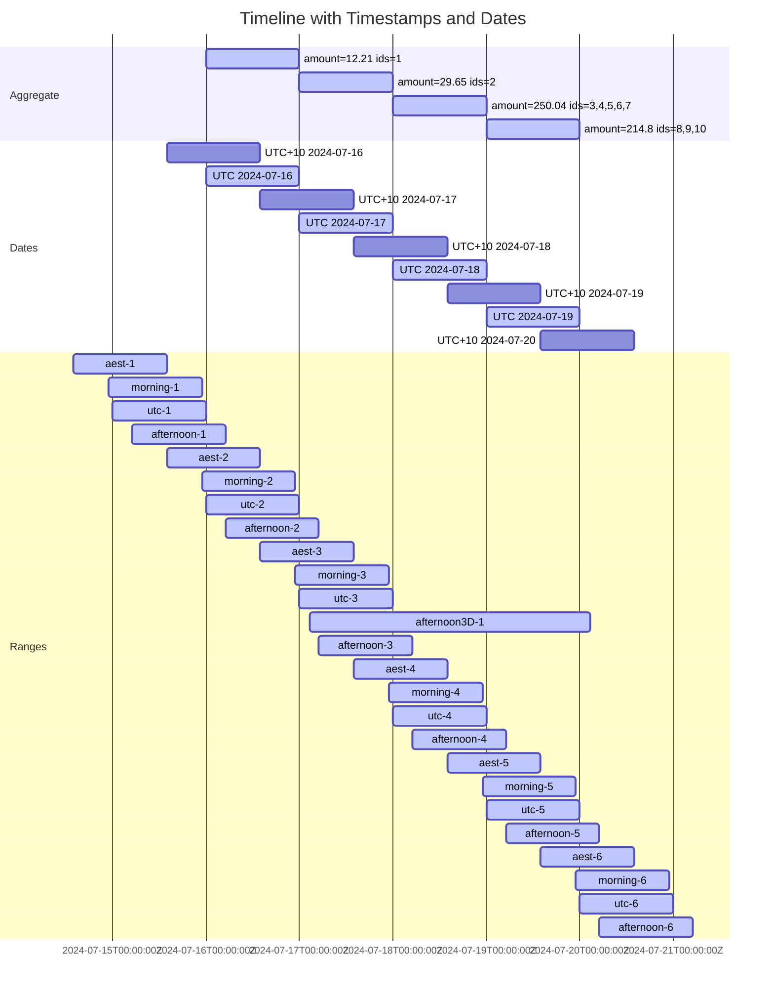

# Dates, Timestamps, and aggregated data

## What?

Aggregation is a technique that can be used to summarize data.
This results in a loss of resolution, that can make it difficult to report on,
especially as the data may not "fit", neatly, into the reporting period.
Data may be aggregated into arbitrary intervals, but is more commonly
aggregated into regular(*), calendar-aligned intervals, such as daily, weekly,
etc. For simplicity, this repository focuses on daily, UTC-aligned aggregation.
Relevant algorithms are provided, e.g. to convert between timestamp and date
ranges, passed down as filters to queries.

(*) For added (but extraneous) fun, consider reading Go's
[time.Time.AddDate](https://pkg.go.dev/time#Time.AddDate) documentation, then
considering the implications of aggregating on calendrical periods.

## Why?

1. Filtering aggregated data using is most obviously problematic where the
   reporting period (range) is smaller than the resolution of the data, e.g.
   daily data, with a range of one hour
2. Difficulties may arise even if the data's resolution is significantly
   greater than the reporting period, if not aligned with it, e.g. reporting on
   a one-week period, solely using UTC-aligned daily data, where the requested
   one-week period starts at midnight, in a different time zone
3. Particularly in the presence of outliers, such misalignment may
   significantly skew results, e.g. in the context of daily reports, where a
   large spike might be either missed, or erroneously included in multiple days
   (along the boundaries of the report - see also "contiguous ranges")
4. Discrepancies are more likely to be evident when presenting reports built
   from multiple sources, as their (mis)alignment may vary, e.g. daily data,
   presented alongside full-resolution data
5. Any discrepancies can make even unrelated issues extremely difficult to
   debug, as it is often not obvious at a glance that such discrepancies exist

## Representing time ranges

### Preface

As noted above, this repository focuses on strategies to handle data aggregated
daily, from midnight to midnight, in UTC. It is assumed that the aggregated
data is stored keyed on a `date` field, representing the relevant day, in UTC.

The provided conversion algorithm provides a mechanism to select such data
using explicit timestamp ranges, which makes it possible to support arbitrary
reporting periods, even across data that is otherwise misaligned, or not
aggregated.

### Considerations

There are three important but unfortunately complex concepts to consider:

**1. Conversion**

Converting a timestamp to any other representation does not require additional
information, so long as the requirements are well-defined.
Converting a date to a timestamp, however, requires an offset, and specific
handling, considerate of the meaning of the date, in the context of the data.
As a special case, it is sometimes useful treat a variation of a timestamp
representation that retains offset information, such as Java's
`OffsetDateTime`, as a date, by truncating the time component. Sometimes known
as "local date", this can be useful for storing or matching against what is
explicitly a geographically-local date. Local dates should be used with care,
as attempting to match against dates in different time zones can lead to
unexpected results.

**2. Contiguous ranges**

In certain contexts, particularly in APIs, it is important that both timestamp
and date ranges facilitate contiguous ranges. This means to allow seamless
concatenation, of consecutive ranges, without overlap.

For example, assuming `startTime` is aligned with the start of the aggregate,
`[startTime, endTime)`, followed by
`[${startTime+1d}, ${endTime+1})`, should guarantee no duplication or gaps.

For timestamps, i.e. for data that isn't aggregated, this might look like
`where values.timestamp >= startTime and values.timestamp < endTime`. For
dates, this might look like `where values.date between startDate and endDate`.

**3. Time is continuous**

Without relying on specific implementation details, an arbitrary-precision
timestamp range can only reliably represent a date range when defined as a
half-open range, like `[startTime, endTime)` (inclusive, exclusive).
Since time is continuous, and dates can be considered discrete (in this
context), it is challenging(*) to represent a date range (using timestamps) as
a closed range, like `[startTime, endTime]` (both inclusive).

(*) In practice, a closed range of nanosecond precision would likely work
end-to-end in most scenarios.

**The definitions that follow are _only_ in the context of this repository.**
These are not even close to the only valid patterns for representing time
ranges.

### Date value (matching against a timestamp range)

To provide a more specific example of a daily aggregate, consider sums of
an arbitrary quantity, e.g. `amount`, where each datapoint is inclusive of all
measurements, given `timestamp` of measurement, and `date` of the
aggregate, such that
`"${date}T00:00:00Z" <= timestamp < "${date + 1 day}T00:00:00Z"`.

### Timestamp value (matching against a date range)

Timestamps are defined as being serialized in RFC 3339 format, with nanosecond
precision. While timestamps include a fixed offset (or `Z`, representing
`+00:00`), the serialized representation is to be explicitly treated as
entirely irrelevant, i.e. timestamp values should be treated no differently to
an equivalent nanosecond-precision epoch.

### Date range (matching against a timestamp value)

A date range is defined as a closed range, like `[startDate, endDate]`, with
the meaning of "inclusive of the entire day of `startDate`, and the entire day
of `endDate`, in UTC". Using the scheme defined above, there are no ambiguities
in terms of conversion. For the avoidance of doubt, the equivalent
timestamp range is
`["${startDate}T00:00:00Z", "${endDate + 1 day}T00:00:00Z")`.

### Timestamp range (matching against a date value)

A timestamp range is defined as a half-open range, like `[startTime, endTime)`,
with the meaning of "inclusive of `startTime`, and exclusive of `endTime`,
where both values are to be treated solely as relative offsets, from the Unix
epoch, with nanosecond precision".

Converting a timestamp range is straightforward but a little unintuitive, see
the algorithms section for more detail.

## Algorithms

### Trivial cases

The result is trivial if either of the following are true:

- Both range and value are identical representations, and that representation
  is one of the variants defined above (or similar, e.g. substituting UTC for
  another fixed-offset zone)
- The range and all possible values are aligned (in our example, all
  `T00:00:00+00:00` aligned)

### Date value, timestamp range

Select only dates where the possible timestamps implied by the date value are
**entirely** within the range. Requires rounding towards the middle of the
range (narrowing the filter), in order to avoid gaps or overlaps.
TODO: Update me

See also `convertTimestampRangeToDates`, below.

### Timestamp value, date range

The date range is converted to the equivalent timestamp range. Lossless, but
requires a half-open range, as discussed above. The most error-prone part is
likely the logic to initialise the implied timestamps correctly at the start of
the day, due to time zone considerations (in this case, in UTC).

See also `convertDateRangeToTimestamps`, below.

## Implementation

TODO: Pseudocode variant might be more useful.

### Overview

The suggested pattern is to implement a "narrowing" timestamp -> date
conversion function, as it is then trivial to use that as a base to generate
both the date range that fully encompasses the timestamp range, and the range
of all dates that are entirely within the timestamp range. In the example
implementations, the "widening" functions are used as part of determining the
former.

N.B. The wide variant may select data that is not entirely within the range,
and therefore may surface data in more than one contiguous range. The narrow
variant will only select data that is entirely within the range, which may
introduce "gaps", or fail to select data, even given contiguous ranges.

In certain contexts it may be desirable to combine the two, or even perform
pre-emptive normalisation. For example, generating a stable URL for a report,
with a "last X days" filter, determined using the local (browser) time zone.

```js
// one option to implement a "last 7 days" filter, with explicit end time
const now = new Date();
const startTime = new Date(now.getTime() - (7 * 24 * 60 * 60 * 1000));
// widen the end time to the start of the next day, if necessary
const endTime = new Date(0);
endTime.setUTCFullYear(now.getUTCFullYear());
endTime.setUTCMonth(now.getUTCMonth());
endTime.setUTCDate(now.getUTCDate());
if (endTime.getTime() !== now.getTime()) {
    endTime.setUTCDate(endTime.getUTCDate() + 1);
}
// like updateReportContext(startTime.toISOString(), endTime.toISOString())
```

### Golang

See [baseline/baseline.go](./baseline/baseline.go), notably
`ExampleTimestampToDate`, `ExampleDateToTimestamp`, and the `Widen*` and
`Matches*` functions.

### PostgreSQL

Fun fact, I've just learnt that `timestamp` is not an "instant" and should be
avoided for use _as a timestamp_, as it is more akin to a "local date".

```postgresql
-- returns the first and last (UTC) date fully within the timestamp range, preserving null values
-- WARNING: queries that omit one of the bounds should explicitly omit the filter criteria (unrelated SQL performance note)
create or replace function convert_timestamp_range_to_dates(start_time timestamptz, end_time timestamptz)
    returns table
            (
                start_date date,
                end_date   date
            )
as
$$
begin
    -- Convert start_time to UTC and handle rounding up to the next day if needed
    if start_time is not null then
        start_time := timezone('UTC', start_time);

        -- Round up to the next day if the time is not at the start of the day
        if start_time::date <> start_time then
            start_time := start_time + interval '1 day';
        end if;

        -- Truncate to date
        start_date := start_time::date;
    else
        start_date := null;
    end if;

    -- Convert end_time to UTC and handle rounding down to the previous day if needed
    if end_time is not null then
        end_time := timezone('UTC', end_time);

        -- Adjust end_time to be exclusive, i.e., the previous day if it's at the start of the day
        end_time := end_time - interval '1 day';

        -- Truncate to date
        end_date := end_time::date;
    else
        end_date := null;
    end if;

    return next;
end;
$$ language plpgsql;

create or replace function widen_start_time(t timestamptz) returns timestamptz as
$$
begin
    return date_trunc('day', t);
end;
$$ language plpgsql;

create or replace function widen_end_time(t timestamptz) returns timestamptz as
$$
begin
    if date_trunc('day', t) = t then
        return t;
    else
        return date_trunc('day', t) + interval '1 day';
    end if;
end;
$$ language plpgsql;

create or replace function widen_range(start_time timestamptz, end_time timestamptz)
    returns table
            (
                wide_start_time timestamptz,
                wide_end_time   timestamptz
            )
as
$$
begin
    wide_start_time := widen_start_time(start_time);
    wide_end_time := widen_end_time(end_time);
    return next;
end;
$$ language plpgsql;

-- In comparison, this case is trivial
create or replace function convert_date_range_to_timestamps(start_date date, end_date date)
    returns table
            (
                start_time timestamptz,
                end_time   timestamptz
            )
as
$$
begin
    if start_date is not null then
        start_time := start_date at time zone 'UTC';
    else
        start_time := null;
    end if;
    if end_date is not null then
        end_time := (end_date + interval '1 day') at time zone 'UTC';
    else
        end_time := null;
    end if;
    return next;
end;
$$ language plpgsql;
```

## Scenarios

### Scenario 1

#### Base data

```tsv
id	timestamp	amount
1	2024-07-16 03:41:28.448509Z	12.21
2	2024-07-17 11:18:45.491452Z	29.65
3	2024-07-18 13:58:28.944852Z	70.43
4	2024-07-18 13:59:49.065872Z	71.72
5	2024-07-18 14:00:00.000000Z	0.53
6	2024-07-18 16:50:58.448308Z	68.65
7	2024-07-18 19:59:27.146321Z	38.71
8	2024-07-19 04:41:49.042058Z	92.75
9	2024-07-19 14:09:32.617819Z	24.35
10	2024-07-19 22:55:52.792650Z	97.7
```

#### Aggregate data

```postgresql
select (timestamp at time zone 'UTC')::date as date, sum(amount) as amount, jsonb_agg(id order by id) as ids
from base_data
group by date
order by date;
```

```tsv
date	amount	ids
2024-07-16	12.21	[1]
2024-07-17	29.65	[2]
2024-07-18	250.04	[3, 4, 5, 6, 7]
2024-07-19	214.8	[8, 9, 10]
```

The total amount is `506.7`.

#### Example queries

In practice, it is unlikely that both `base_data` and `aggregate_data` would be
used simultaneously (e.g. displayed on the same page or report). In this case,
the raw data is intended to highlight discrepancies. The `base_data` may be
considered representative of the behavior that other finer-grain (e.g.
timestamp) data (that might be displayed in the same context) could exhibit.

```postgresql
select id, timestamp, amount
from base_data
where timestamp >= :start_time
  and timestamp < :end_time
order by timestamp;
```

```postgresql
select date, amount
from aggregate_data
where date between :start_date and :end_date
order by date;
```

#### Results

N.B. Queries are down the bottom of this section.

##### Total amount by group

The following table is the output of the `amounts_total` query. The `ad_*`
columns are sums from selected `aggregate_data` rows, and the `bd_*` columns
are sums from selected `base_data` rows. The suffix indicates whether each of
the start and end were "wide" (extended to the encapsulating day), or "narrow"
(only inclusive of fully-encapsulated days).

As a baseline, a deliberately naive timestamp -> date implementation was used,
suffixed with `_l` (for local). While this implementation _appears_ somewhat
correct, it will vary, based on the passed timezone, and will only perform
roughly equivalently for callers providing UTC-equivalent timestamp ranges.
For all other data, the result set may be significantly skewed, as shown by
the difference between `ad_n` and `ad_l`, for the `afternoon3D...` group
(which is a 3d period, starting from `T15:00:00-11:35`).

| group          | actual | bd_w   | bd_wn  | bd_nw  | ad_n   | ad_w   | ad_wn  | ad_nw  | ad_l  |
|----------------|--------|--------|--------|--------|--------|--------|--------|--------|-------|
| aest           | 506.7  | 1013.4 | 783.46 | 736.64 |        | 1013.4 | 506.7  | 506.7  | 506.7 |
| afternoon      | 506.7  | 1013.4 | 611.66 | 908.44 |        | 1013.4 | 506.7  | 506.7  | 506.7 |
| afternoon3D... | 494.49 | 494.49 | 494.49 | 494.49 | 464.84 | 494.49 | 494.49 | 464.84 | 291.9 |
| morning        | 506.7  | 1013.4 | 1013.4 | 506.7  |        | 1013.4 | 506.7  | 506.7  | 506.7 |
| utc            | 506.7  | 506.7  | 506.7  | 506.7  | 506.7  | 506.7  | 506.7  | 506.7  | 506.7 |

##### Per-day

###### Visualizing days



###### Table

| name           | start_time           | end_time             | wide_start_time      | wide_end_time        | start_date | end_date   | wide_start_date | wide_end_date | local_start_date | local_end_date | bd_n_amount | bd_w_amount | bd_wn_amount | bd_nw_amount | bd_l_amount | ad_n_amount | ad_w_amount | ad_wn_amount | ad_nw_amount | ad_l_amount | bd_n_ids                     | bd_w_ids                     | bd_wn_ids                    | bd_nw_ids                    | bd_l_ids              | ad_n_ids                  | ad_w_ids                     | ad_wn_ids                    | ad_nw_ids                 | ad_l_ids              |
|----------------|----------------------|----------------------|----------------------|----------------------|------------|------------|-----------------|---------------|------------------|----------------|-------------|-------------|--------------|--------------|-------------|-------------|-------------|--------------|--------------|-------------|------------------------------|------------------------------|------------------------------|------------------------------|-----------------------|---------------------------|------------------------------|------------------------------|---------------------------|-----------------------|
| aest-1         | 2024-07-14 14:00...Z | 2024-07-15 14:00...Z | 2024-07-14 00:00...Z | 2024-07-16 00:00...Z | 2024-07-15 | 2024-07-14 | 2024-07-14      | 2024-07-15    | 2024-07-15       | 2024-07-15     |             |             |              |              |             |             |             |              |              |             |                              |                              |                              |                              |                       |                           |                              |                              |                           |                       |
| aest-2         | 2024-07-15 14:00...Z | 2024-07-16 14:00...Z | 2024-07-15 00:00...Z | 2024-07-17 00:00...Z | 2024-07-16 | 2024-07-15 | 2024-07-15      | 2024-07-16    | 2024-07-16       | 2024-07-16     | 12.21       | 12.21       | 12.21        | 12.21        | 12.21       |             | 12.21       |              | 12.21        | 12.21       | [1]                          | [1]                          | [1]                          | [1]                          | [1]                   |                           | [1]                          |                              | [1]                       | [1]                   |
| aest-3         | 2024-07-16 14:00...Z | 2024-07-17 14:00...Z | 2024-07-16 00:00...Z | 2024-07-18 00:00...Z | 2024-07-17 | 2024-07-16 | 2024-07-16      | 2024-07-17    | 2024-07-17       | 2024-07-17     | 29.65       | 41.86       | 41.86        | 29.65        | 29.65       |             | 41.86       | 12.21        | 29.65        | 29.65       | [2]                          | [1, 2]                       | [1, 2]                       | [2]                          | [2]                   |                           | [1, 2]                       | [1]                          | [2]                       | [2]                   |
| aest-4         | 2024-07-17 14:00...Z | 2024-07-18 14:00...Z | 2024-07-17 00:00...Z | 2024-07-19 00:00...Z | 2024-07-18 | 2024-07-17 | 2024-07-17      | 2024-07-18    | 2024-07-18       | 2024-07-18     | 142.15      | 279.69      | 171.8        | 250.04       | 250.04      |             | 279.69      | 29.65        | 250.04       | 250.04      | [3, 4]                       | [2, 3, 4, 5, 6, 7]           | [2, 3, 4]                    | [3, 4, 5, 6, 7]              | [3, 4, 5, 6, 7]       |                           | [2, 3, 4, 5, 6, 7]           | [2]                          | [3, 4, 5, 6, 7]           | [3, 4, 5, 6, 7]       |
| aest-5         | 2024-07-18 14:00...Z | 2024-07-19 14:00...Z | 2024-07-18 00:00...Z | 2024-07-20 00:00...Z | 2024-07-19 | 2024-07-18 | 2024-07-18      | 2024-07-19    | 2024-07-19       | 2024-07-19     | 200.64      | 464.84      | 342.79       | 322.69       | 214.8       |             | 464.84      | 250.04       | 214.8        | 214.8       | [5, 6, 7, 8]                 | [3, 4, 5, 6, 7, 8, 9, 10]    | [3, 4, 5, 6, 7, 8]           | [5, 6, 7, 8, 9, 10]          | [8, 9, 10]            |                           | [3, 4, 5, 6, 7, 8, 9, 10]    | [3, 4, 5, 6, 7]              | [8, 9, 10]                | [8, 9, 10]            |
| aest-6         | 2024-07-19 14:00...Z | 2024-07-20 14:00...Z | 2024-07-19 00:00...Z | 2024-07-21 00:00...Z | 2024-07-20 | 2024-07-19 | 2024-07-19      | 2024-07-20    | 2024-07-20       | 2024-07-20     | 122.05      | 214.8       | 214.8        | 122.05       |             |             | 214.8       | 214.8        |              |             | [9, 10]                      | [8, 9, 10]                   | [8, 9, 10]                   | [9, 10]                      |                       |                           | [8, 9, 10]                   | [8, 9, 10]                   |                           |                       |
| afternoon-1    | 2024-07-15 05:00...Z | 2024-07-16 05:00...Z | 2024-07-15 00:00...Z | 2024-07-17 00:00...Z | 2024-07-16 | 2024-07-15 | 2024-07-15      | 2024-07-16    | 2024-07-15       | 2024-07-15     | 12.21       | 12.21       | 12.21        | 12.21        |             |             | 12.21       |              | 12.21        |             | [1]                          | [1]                          | [1]                          | [1]                          |                       |                           | [1]                          |                              | [1]                       |                       |
| afternoon-2    | 2024-07-16 05:00...Z | 2024-07-17 05:00...Z | 2024-07-16 00:00...Z | 2024-07-18 00:00...Z | 2024-07-17 | 2024-07-16 | 2024-07-16      | 2024-07-17    | 2024-07-16       | 2024-07-16     |             | 41.86       | 12.21        | 29.65        | 12.21       |             | 41.86       | 12.21        | 29.65        | 12.21       |                              | [1, 2]                       | [1]                          | [2]                          | [1]                   |                           | [1, 2]                       | [1]                          | [2]                       | [1]                   |
| afternoon-3    | 2024-07-17 05:00...Z | 2024-07-18 05:00...Z | 2024-07-17 00:00...Z | 2024-07-19 00:00...Z | 2024-07-18 | 2024-07-17 | 2024-07-17      | 2024-07-18    | 2024-07-17       | 2024-07-17     | 29.65       | 279.69      | 29.65        | 279.69       | 29.65       |             | 279.69      | 29.65        | 250.04       | 29.65       | [2]                          | [2, 3, 4, 5, 6, 7]           | [2]                          | [2, 3, 4, 5, 6, 7]           | [2]                   |                           | [2, 3, 4, 5, 6, 7]           | [2]                          | [3, 4, 5, 6, 7]           | [2]                   |
| afternoon-4    | 2024-07-18 05:00...Z | 2024-07-19 05:00...Z | 2024-07-18 00:00...Z | 2024-07-20 00:00...Z | 2024-07-19 | 2024-07-18 | 2024-07-18      | 2024-07-19    | 2024-07-18       | 2024-07-18     | 342.79      | 464.84      | 342.79       | 464.84       | 250.04      |             | 464.84      | 250.04       | 214.8        | 250.04      | [3, 4, 5, 6, 7, 8]           | [3, 4, 5, 6, 7, 8, 9, 10]    | [3, 4, 5, 6, 7, 8]           | [3, 4, 5, 6, 7, 8, 9, 10]    | [3, 4, 5, 6, 7]       |                           | [3, 4, 5, 6, 7, 8, 9, 10]    | [3, 4, 5, 6, 7]              | [8, 9, 10]                | [3, 4, 5, 6, 7]       |
| afternoon-5    | 2024-07-19 05:00...Z | 2024-07-20 05:00...Z | 2024-07-19 00:00...Z | 2024-07-21 00:00...Z | 2024-07-20 | 2024-07-19 | 2024-07-19      | 2024-07-20    | 2024-07-19       | 2024-07-19     | 122.05      | 214.8       | 214.8        | 122.05       | 214.8       |             | 214.8       | 214.8        |              | 214.8       | [9, 10]                      | [8, 9, 10]                   | [8, 9, 10]                   | [9, 10]                      | [8, 9, 10]            |                           | [8, 9, 10]                   | [8, 9, 10]                   |                           | [8, 9, 10]            |
| afternoon-6    | 2024-07-20 05:00...Z | 2024-07-21 05:00...Z | 2024-07-20 00:00...Z | 2024-07-22 00:00...Z | 2024-07-21 | 2024-07-20 | 2024-07-20      | 2024-07-21    | 2024-07-20       | 2024-07-20     |             |             |              |              |             |             |             |              |              |             |                              |                              |                              |                              |                       |                           |                              |                              |                           |                       |
| afternoon3D... | 2024-07-17 02:35...Z | 2024-07-20 02:35...Z | 2024-07-17 00:00...Z | 2024-07-21 00:00...Z | 2024-07-18 | 2024-07-19 | 2024-07-17      | 2024-07-20    | 2024-07-16       | 2024-07-18     | 494.49      | 494.49      | 494.49       | 494.49       | 291.9       | 464.84      | 494.49      | 494.49       | 464.84       | 291.9       | [2, 3, 4, 5, 6, 7, 8, 9, 10] | [2, 3, 4, 5, 6, 7, 8, 9, 10] | [2, 3, 4, 5, 6, 7, 8, 9, 10] | [2, 3, 4, 5, 6, 7, 8, 9, 10] | [1, 2, 3, 4, 5, 6, 7] | [3, 4, 5, 6, 7, 8, 9, 10] | [2, 3, 4, 5, 6, 7, 8, 9, 10] | [2, 3, 4, 5, 6, 7, 8, 9, 10] | [3, 4, 5, 6, 7, 8, 9, 10] | [1, 2, 3, 4, 5, 6, 7] |
| morning-1      | 2024-07-14 23:00...Z | 2024-07-15 23:00...Z | 2024-07-14 00:00...Z | 2024-07-16 00:00...Z | 2024-07-15 | 2024-07-14 | 2024-07-14      | 2024-07-15    | 2024-07-15       | 2024-07-15     |             |             |              |              |             |             |             |              |              |             |                              |                              |                              |                              |                       |                           |                              |                              |                           |                       |
| morning-2      | 2024-07-15 23:00...Z | 2024-07-16 23:00...Z | 2024-07-15 00:00...Z | 2024-07-17 00:00...Z | 2024-07-16 | 2024-07-15 | 2024-07-15      | 2024-07-16    | 2024-07-16       | 2024-07-16     | 12.21       | 12.21       | 12.21        | 12.21        | 12.21       |             | 12.21       |              | 12.21        | 12.21       | [1]                          | [1]                          | [1]                          | [1]                          | [1]                   |                           | [1]                          |                              | [1]                       | [1]                   |
| morning-3      | 2024-07-16 23:00...Z | 2024-07-17 23:00...Z | 2024-07-16 00:00...Z | 2024-07-18 00:00...Z | 2024-07-17 | 2024-07-16 | 2024-07-16      | 2024-07-17    | 2024-07-17       | 2024-07-17     | 29.65       | 41.86       | 41.86        | 29.65        | 29.65       |             | 41.86       | 12.21        | 29.65        | 29.65       | [2]                          | [1, 2]                       | [1, 2]                       | [2]                          | [2]                   |                           | [1, 2]                       | [1]                          | [2]                       | [2]                   |
| morning-4      | 2024-07-17 23:00...Z | 2024-07-18 23:00...Z | 2024-07-17 00:00...Z | 2024-07-19 00:00...Z | 2024-07-18 | 2024-07-17 | 2024-07-17      | 2024-07-18    | 2024-07-18       | 2024-07-18     | 250.04      | 279.69      | 279.69       | 250.04       | 250.04      |             | 279.69      | 29.65        | 250.04       | 250.04      | [3, 4, 5, 6, 7]              | [2, 3, 4, 5, 6, 7]           | [2, 3, 4, 5, 6, 7]           | [3, 4, 5, 6, 7]              | [3, 4, 5, 6, 7]       |                           | [2, 3, 4, 5, 6, 7]           | [2]                          | [3, 4, 5, 6, 7]           | [3, 4, 5, 6, 7]       |
| morning-5      | 2024-07-18 23:00...Z | 2024-07-19 23:00...Z | 2024-07-18 00:00...Z | 2024-07-20 00:00...Z | 2024-07-19 | 2024-07-18 | 2024-07-18      | 2024-07-19    | 2024-07-19       | 2024-07-19     | 214.8       | 464.84      | 464.84       | 214.8        | 214.8       |             | 464.84      | 250.04       | 214.8        | 214.8       | [8, 9, 10]                   | [3, 4, 5, 6, 7, 8, 9, 10]    | [3, 4, 5, 6, 7, 8, 9, 10]    | [8, 9, 10]                   | [8, 9, 10]            |                           | [3, 4, 5, 6, 7, 8, 9, 10]    | [3, 4, 5, 6, 7]              | [8, 9, 10]                | [8, 9, 10]            |
| morning-6      | 2024-07-19 23:00...Z | 2024-07-20 23:00...Z | 2024-07-19 00:00...Z | 2024-07-21 00:00...Z | 2024-07-20 | 2024-07-19 | 2024-07-19      | 2024-07-20    | 2024-07-20       | 2024-07-20     |             | 214.8       | 214.8        |              |             |             | 214.8       | 214.8        |              |             |                              | [8, 9, 10]                   | [8, 9, 10]                   |                              |                       |                           | [8, 9, 10]                   | [8, 9, 10]                   |                           |                       |
| utc-1          | 2024-07-15 00:00...Z | 2024-07-16 00:00...Z | 2024-07-15 00:00...Z | 2024-07-16 00:00...Z | 2024-07-15 | 2024-07-15 | 2024-07-15      | 2024-07-15    | 2024-07-15       | 2024-07-15     |             |             |              |              |             |             |             |              |              |             |                              |                              |                              |                              |                       |                           |                              |                              |                           |                       |
| utc-2          | 2024-07-16 00:00...Z | 2024-07-17 00:00...Z | 2024-07-16 00:00...Z | 2024-07-17 00:00...Z | 2024-07-16 | 2024-07-16 | 2024-07-16      | 2024-07-16    | 2024-07-16       | 2024-07-16     | 12.21       | 12.21       | 12.21        | 12.21        | 12.21       | 12.21       | 12.21       | 12.21        | 12.21        | 12.21       | [1]                          | [1]                          | [1]                          | [1]                          | [1]                   | [1]                       | [1]                          | [1]                          | [1]                       | [1]                   |
| utc-3          | 2024-07-17 00:00...Z | 2024-07-18 00:00...Z | 2024-07-17 00:00...Z | 2024-07-18 00:00...Z | 2024-07-17 | 2024-07-17 | 2024-07-17      | 2024-07-17    | 2024-07-17       | 2024-07-17     | 29.65       | 29.65       | 29.65        | 29.65        | 29.65       | 29.65       | 29.65       | 29.65        | 29.65        | 29.65       | [2]                          | [2]                          | [2]                          | [2]                          | [2]                   | [2]                       | [2]                          | [2]                          | [2]                       | [2]                   |
| utc-4          | 2024-07-18 00:00...Z | 2024-07-19 00:00...Z | 2024-07-18 00:00...Z | 2024-07-19 00:00...Z | 2024-07-18 | 2024-07-18 | 2024-07-18      | 2024-07-18    | 2024-07-18       | 2024-07-18     | 250.04      | 250.04      | 250.04       | 250.04       | 250.04      | 250.04      | 250.04      | 250.04       | 250.04       | 250.04      | [3, 4, 5, 6, 7]              | [3, 4, 5, 6, 7]              | [3, 4, 5, 6, 7]              | [3, 4, 5, 6, 7]              | [3, 4, 5, 6, 7]       | [3, 4, 5, 6, 7]           | [3, 4, 5, 6, 7]              | [3, 4, 5, 6, 7]              | [3, 4, 5, 6, 7]           | [3, 4, 5, 6, 7]       |
| utc-5          | 2024-07-19 00:00...Z | 2024-07-20 00:00...Z | 2024-07-19 00:00...Z | 2024-07-20 00:00...Z | 2024-07-19 | 2024-07-19 | 2024-07-19      | 2024-07-19    | 2024-07-19       | 2024-07-19     | 214.8       | 214.8       | 214.8        | 214.8        | 214.8       | 214.8       | 214.8       | 214.8        | 214.8        | 214.8       | [8, 9, 10]                   | [8, 9, 10]                   | [8, 9, 10]                   | [8, 9, 10]                   | [8, 9, 10]            | [8, 9, 10]                | [8, 9, 10]                   | [8, 9, 10]                   | [8, 9, 10]                | [8, 9, 10]            |
| utc-6          | 2024-07-20 00:00...Z | 2024-07-21 00:00...Z | 2024-07-20 00:00...Z | 2024-07-21 00:00...Z | 2024-07-20 | 2024-07-20 | 2024-07-20      | 2024-07-20    | 2024-07-20       | 2024-07-20     |             |             |              |              |             |             |             |              |              |             |                              |                              |                              |                              |                       |                           |                              |                              |                           |                       |

##### Queries

```postgresql
-- nasty query for poking at it :)
with per_day as ( select timestamp_ranges.name,
                         timestamp_ranges.start_time,
                         timestamp_ranges.end_time,
                         timestamp_ranges.wide_start_time,
                         timestamp_ranges.wide_end_time,
                         timestamp_ranges.start_date,
                         timestamp_ranges.end_date,
                         timestamp_ranges.wide_start_date,
                         timestamp_ranges.wide_end_date,
                         timestamp_ranges.local_start_date,
                         timestamp_ranges.local_end_date,
                         bd_n.amount  as bd_n_amount,
                         bd_w.amount  as bd_w_amount,
                         bd_wn.amount as bd_wn_amount,
                         bd_nw.amount as bd_nw_amount,
                         bd_l.amount  as bd_l_amount,
                         ad_n.amount  as ad_n_amount,
                         ad_w.amount  as ad_w_amount,
                         ad_wn.amount as ad_wn_amount,
                         ad_nw.amount as ad_nw_amount,
                         ad_l.amount  as ad_l_amount,
                         bd_n.ids     as bd_n_ids,
                         bd_w.ids     as bd_w_ids,
                         bd_wn.ids    as bd_wn_ids,
                         bd_nw.ids    as bd_nw_ids,
                         bd_l.ids     as bd_l_ids,
                         ad_n.ids     as ad_n_ids,
                         ad_w.ids     as ad_w_ids,
                         ad_wn.ids    as ad_wn_ids,
                         ad_nw.ids    as ad_nw_ids,
                         ad_l.ids     as ad_l_ids
                  from ( select name,
                                a::timestamptz              as start_time,
                                b::timestamptz              as end_time,
                                wide_ranges.wide_start_time,
                                wide_ranges.wide_end_time,
                                narrow_dates.start_date,
                                narrow_dates.end_date,
                                wide_dates.start_date       as wide_start_date,
                                wide_dates.end_date         as wide_end_date,
                                local_timestamps.start_time as local_start_time,
                                local_timestamps.end_time   as local_end_time,
                                local_dates.start_date      as local_start_date,
                                local_dates.end_date        as local_end_date
                         from ( values ('utc-1', '2024-07-15T00:00:00Z', '2024-07-16T00:00:00Z'),
                                       ('utc-2', '2024-07-16T00:00:00Z', '2024-07-17T00:00:00Z'),
                                       ('utc-3', '2024-07-17T00:00:00Z', '2024-07-18T00:00:00Z'),
                                       ('utc-4', '2024-07-18T00:00:00Z', '2024-07-19T00:00:00Z'),
                                       ('utc-5', '2024-07-19T00:00:00Z', '2024-07-20T00:00:00Z'),
                                       ('utc-6', '2024-07-20T00:00:00Z', '2024-07-21T00:00:00Z'),
                                       ('aest-1', '2024-07-15T00:00:00+10:00', '2024-07-16T00:00:00+10:00'),
                                       ('aest-2', '2024-07-16T00:00:00+10:00', '2024-07-17T00:00:00+10:00'),
                                       ('aest-3', '2024-07-17T00:00:00+10:00', '2024-07-18T00:00:00+10:00'),
                                       ('aest-4', '2024-07-18T00:00:00+10:00', '2024-07-19T00:00:00+10:00'),
                                       ('aest-5', '2024-07-19T00:00:00+10:00', '2024-07-20T00:00:00+10:00'),
                                       ('aest-6', '2024-07-20T00:00:00+10:00', '2024-07-21T00:00:00+10:00'),
                                       ('morning-1', '2024-07-15T09:00:00+10:00', '2024-07-16T09:00:00+10:00'),
                                       ('morning-2', '2024-07-16T09:00:00+10:00', '2024-07-17T09:00:00+10:00'),
                                       ('morning-3', '2024-07-17T09:00:00+10:00', '2024-07-18T09:00:00+10:00'),
                                       ('morning-4', '2024-07-18T09:00:00+10:00', '2024-07-19T09:00:00+10:00'),
                                       ('morning-5', '2024-07-19T09:00:00+10:00', '2024-07-20T09:00:00+10:00'),
                                       ('morning-6', '2024-07-20T09:00:00+10:00', '2024-07-21T09:00:00+10:00'),
                                       ('afternoon-1', '2024-07-15T15:00:00+10:00', '2024-07-16T15:00:00+10:00'),
                                       ('afternoon-2', '2024-07-16T15:00:00+10:00', '2024-07-17T15:00:00+10:00'),
                                       ('afternoon-3', '2024-07-17T15:00:00+10:00', '2024-07-18T15:00:00+10:00'),
                                       ('afternoon-4', '2024-07-18T15:00:00+10:00', '2024-07-19T15:00:00+10:00'),
                                       ('afternoon-5', '2024-07-19T15:00:00+10:00', '2024-07-20T15:00:00+10:00'),
                                       ('afternoon-6', '2024-07-20T15:00:00+10:00', '2024-07-21T15:00:00+10:00'),
                                       ('afternoon3DayForNegativeOffset', '2024-07-16T15:00:00-11:35',
                                        '2024-07-19T15:00:00-11:35'),
                                       ('pst-1', '2024-07-15T00:00:00-08:00', '2024-07-16T00:00:00-08:00'),
                                       ('pst-2', '2024-07-16T00:00:00-08:00', '2024-07-17T00:00:00-08:00'),
                                       ('pst-3', '2024-07-17T00:00:00-08:00', '2024-07-18T00:00:00-08:00'),
                                       ('pst-4', '2024-07-18T00:00:00-08:00', '2024-07-19T00:00:00-08:00'),
                                       ('pst-5', '2024-07-19T00:00:00-08:00', '2024-07-20T00:00:00-08:00'),
                                       ('pst-6', '2024-07-20T00:00:00-08:00',
                                        '2024-07-21T00:00:00-08:00') ) v (name, a, b),
                              lateral widen_range(a::timestamptz, b::timestamptz) wide_ranges,
                              lateral convert_timestamp_range_to_dates(a::timestamptz, b::timestamptz) narrow_dates,
                              lateral convert_timestamp_range_to_dates(wide_ranges.wide_start_time,
                                                                       wide_ranges.wide_end_time) wide_dates,
                              lateral (select a::timestamp::date                      as start_date,
                                              (b::timestamp - interval '1 day')::date as end_date ) local_dates,
                              lateral convert_date_range_to_timestamps(local_dates.start_date,
                                                                       local_dates.end_date) local_timestamps ) timestamp_ranges,

                       lateral (select jsonb_agg(id order by id) as ids, sum(amount) as amount
                                from scenario_1 base_data
                                where base_data.timestamp >= timestamp_ranges.start_time
                                  and base_data.timestamp < timestamp_ranges.end_time) bd_n,
                       lateral (select jsonb_agg(id order by id) as ids, sum(amount) as amount
                                from scenario_1 base_data
                                where (timestamp at time zone 'UTC')::date between timestamp_ranges.start_date and timestamp_ranges.end_date) ad_n,

                       lateral (select jsonb_agg(id order by id) as ids, sum(amount) as amount
                                from scenario_1 base_data
                                where base_data.timestamp >= timestamp_ranges.wide_start_time
                                  and base_data.timestamp < timestamp_ranges.wide_end_time) bd_w,
                       lateral (select jsonb_agg(id order by id) as ids, sum(amount) as amount
                                from scenario_1 base_data
                                where (timestamp at time zone 'UTC')::date between timestamp_ranges.wide_start_date and timestamp_ranges.wide_end_date) ad_w,

                       lateral (select jsonb_agg(id order by id) as ids, sum(amount) as amount
                                from scenario_1 base_data
                                where base_data.timestamp >= timestamp_ranges.wide_start_time
                                  and base_data.timestamp < timestamp_ranges.end_time) bd_wn,
                       lateral (select jsonb_agg(id order by id) as ids, sum(amount) as amount
                                from scenario_1 base_data
                                where (timestamp at time zone 'UTC')::date between timestamp_ranges.wide_start_date and timestamp_ranges.end_date) ad_wn,

                       lateral (select jsonb_agg(id order by id) as ids, sum(amount) as amount
                                from scenario_1 base_data
                                where base_data.timestamp >= timestamp_ranges.start_time
                                  and base_data.timestamp < timestamp_ranges.wide_end_time) bd_nw,
                       lateral (select jsonb_agg(id order by id) as ids, sum(amount) as amount
                                from scenario_1 base_data
                                where (timestamp at time zone 'UTC')::date between timestamp_ranges.start_date and timestamp_ranges.wide_end_date) ad_nw,

                       lateral (select jsonb_agg(id order by id) as ids, sum(amount) as amount
                                from scenario_1 base_data
                                where base_data.timestamp >= timestamp_ranges.local_start_time
                                  and base_data.timestamp < timestamp_ranges.local_end_time) bd_l,
                       lateral (select jsonb_agg(id order by id) as ids, sum(amount) as amount
                                from scenario_1 base_data
                                where (timestamp at time zone 'UTC')::date between timestamp_ranges.local_start_date and timestamp_ranges.local_end_date) ad_l
                  order by substring(name from '^[^-]*'), start_time, end_time ),
     amounts_total as ( select substring(per_day.name from '^[^-]*') as grp,
                               sum(bd_n_amount)                      as bd_n_amount,
                               sum(bd_w_amount)                      as bd_w_amount,
                               sum(bd_wn_amount)                     as bd_wn_amount,
                               sum(bd_nw_amount)                     as bd_nw_amount,
                               sum(bd_l_amount)                      as bd_l_amount,
                               sum(ad_n_amount)                      as ad_n_amount,
                               sum(ad_w_amount)                      as ad_w_amount,
                               sum(ad_wn_amount)                     as ad_wn_amount,
                               sum(ad_nw_amount)                     as ad_nw_amount,
                               sum(ad_l_amount)                      as ad_l_amount
                        from per_day
                        group by grp
                        order by grp )
select *
from amounts_total;
```
